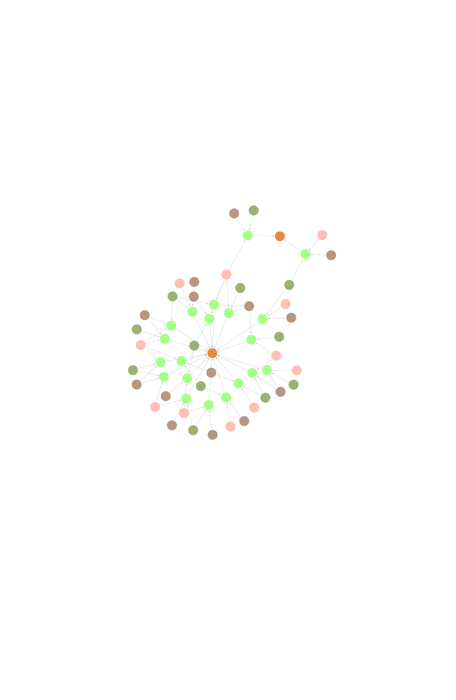
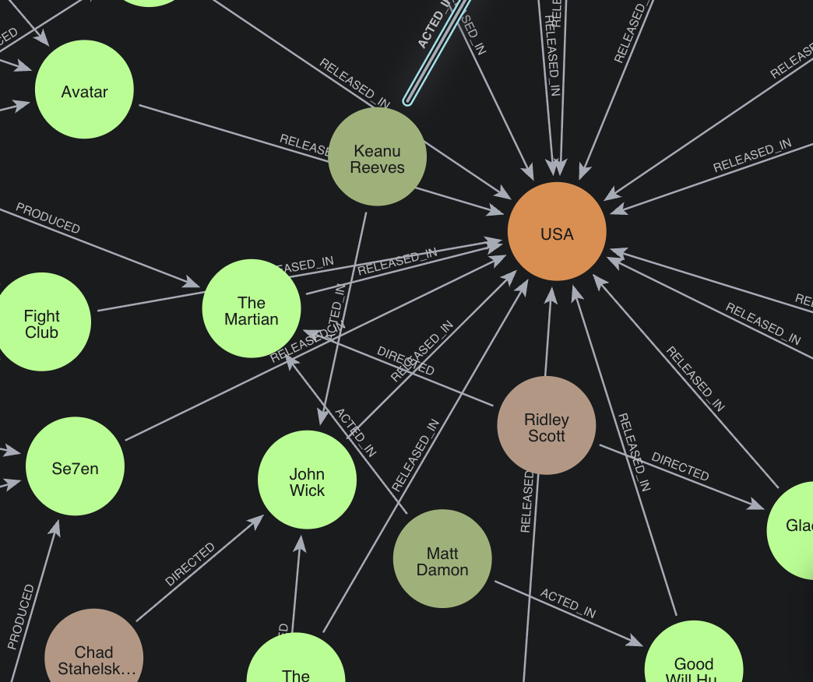

# Knowledge Graphs

## Definition

A **Knowledge Graph** is a structured data model that represents real-world entities (such as people, places, or things) and the relationships between them. It organizes information as a network of nodes (entities) and edges (relationships), enabling both humans and machines to understand and reason about complex data.

## Concepts

- **Entity (Node):** An object or concept, such as a movie, actor, director, or genre.
- **Relationship (Edge):** A connection between two entities, such as "acted_in", "directed_by", or "belongs_to_genre".
- **Attribute:** A property or characteristic of an entity (e.g., a movie's release year or an actor's birthdate).
- **Triplet:** The basic unit of a knowledge graph, typically in the form (subject, predicate, object), e.g., ("Inception", "directed_by", "Christopher Nolan").

## Elaboration

Knowledge graphs are powerful tools for integrating, managing, and querying complex data. They are widely used in search engines, recommendation systems, and artificial intelligence applications. By representing data as a graph, knowledge graphs make it easier to discover hidden relationships, perform semantic searches, and infer new knowledge.

### Key Benefits

- **Semantic Understanding:** Captures the meaning and context of data.
- **Data Integration:** Combines information from multiple sources.
- **Reasoning:** Enables inference of new facts from existing data.
- **Explainability:** Makes relationships between data points transparent.

## Example: Movies Knowledge Graph

Suppose we have a dataset of movies stored in `movies.csv` with columns such as:

- `movie_id`
- `title`
- `release_year`
- `genre`
- `director`
- `actor_1`
- `actor_2`
- ...

### Example Data (movies.csv)

| movie_id | title        | release_year | genre      | director         | actor_1        | actor_2        |
|----------|--------------|-------------|------------|------------------|----------------|----------------|
| 1        | The Matrix   | 1999        | Sci-Fi     | Lana Wachowski   | Keanu Reeves   | Laurence Fishburne |
| 2        | Inception    | 2010        | Sci-Fi     | Christopher Nolan| Leonardo DiCaprio | Joseph Gordon-Levitt |

### How This Data Forms a Knowledge Graph

Each row in `movies.csv` can be transformed into a set of entities and relationships:

#### Entities

- Movies: "The Matrix", "Inception"
- Directors: "Lana Wachowski", "Christopher Nolan"
- Actors: "Keanu Reeves", "Laurence Fishburne", "Leonardo DiCaprio", "Joseph Gordon-Levitt"
- Genres: "Sci-Fi"

#### Relationships

- "The Matrix" **directed_by** "Lana Wachowski"
- "The Matrix" **starred** "Keanu Reeves"
- "The Matrix" **starred** "Laurence Fishburne"
- "The Matrix" **belongs_to_genre** "Sci-Fi"
- "Inception" **directed_by** "Christopher Nolan"
- "Inception" **starred** "Leonardo DiCaprio"
- "Inception" **starred** "Joseph Gordon-Levitt"
- "Inception" **belongs_to_genre** "Sci-Fi"

#### Triplets

- ("The Matrix", "directed_by", "Lana Wachowski")
- ("The Matrix", "starred", "Keanu Reeves")
- ("The Matrix", "starred", "Laurence Fishburne")
- ("The Matrix", "belongs_to_genre", "Sci-Fi")
- ("Inception", "directed_by", "Christopher Nolan")
- ("Inception", "starred", "Leonardo DiCaprio")
- ("Inception", "starred", "Joseph Gordon-Levitt")
- ("Inception", "belongs_to_genre", "Sci-Fi")

### Visualization

The knowledge graph can be visualized as:

This is how it looks like:

## Summary

A knowledge graph transforms tabular data (like `movies.csv`) into a network of entities and relationships, making it easier to query, analyze, and discover new insights about the data.

---